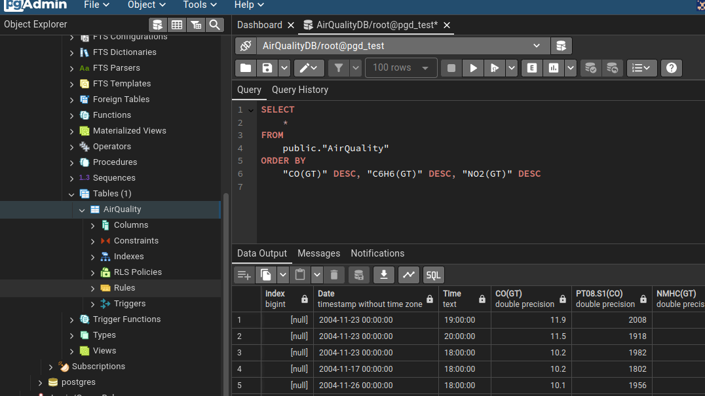
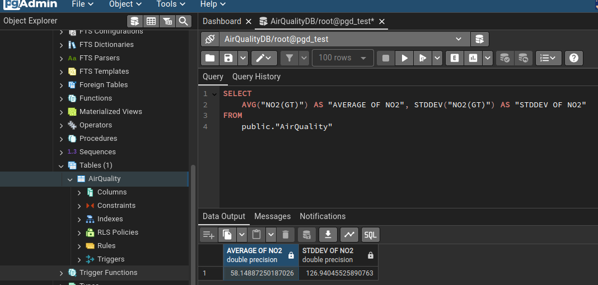
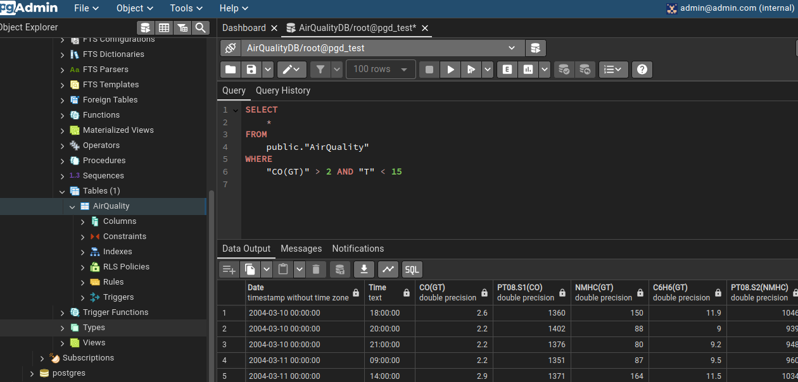

<!-- TOC -->

- [Air quality](#air-quality)
  - [](#)
  - [Posgresql container](#posgresql-container)
    - [CLI for Postgres](#cli-for-postgres)
  - [pgAdmin](#pgadmin)
- [Ingesting the data](#ingesting-the-data)
- [Queries](#queries)

<!-- /TOC -->

# Air quality
Without use docker-compose, we can create a posgresql-pgadmin as follows:
##
```bash
docker network create pg-network
```
## Posgresql container
```bash
docker run -it -d \
  -e POSTGRES_USER="root" \
  -e POSTGRES_PASSWORD="root" \
  -e POSTGRES_DB="AirQualityDB" \
  -v $(pwd)/air_quality_db:/var/lib/postgresql/data \
  -p 5432:5432 \
  --network=pg-network \
  --name pg-database \
  postgres:13 
```
### CLI for Postgres

In a conda environment

```bash
conda install -c conda-forge pgcli
pip install -U mycli
```

Using `pgcli` to connect to Postgres

```bash
pgcli -h localhost -p 5432 -u root -d AirQualityDB
```

## pgAdmin

Running pgAdmin

```bash
docker run -it -d \
  -e PGADMIN_DEFAULT_EMAIL="admin@admin.com" \
  -e PGADMIN_DEFAULT_PASSWORD="root" \
  -p 8080:80 \
  --network=pg-network \
  --name pgadmin \
  dpage/pgadmin4
```

# Ingesting the data

URL="https://archive.ics.uci.edu/static/public/360/air+quality.zip"

```bash
python ingest_airquality.py \
  --user=root \
  --password=root \
  --host=localhost \
  --port=5432 \
  --db=AirQualityDB \
  --table_name=AirQuality \
  --url=${URL}
```

# Queries
In PostgreSQL we did the following query:
```bash
SELECT 
	* 
FROM 
	public."AirQuality"
ORDER BY
	"CO(GT)" DESC, "C6H6(GT)" DESC, "NO2(GT)" DESC
```


```bash
SELECT 
	AVG("NO2(GT)") AS "AVERAGE OF NO2", STDDEV("NO2(GT)") AS "STDDEV OF NO2"
FROM 
	public."AirQuality"
```


```bash
SELECT 
	* 
FROM 
	public."AirQuality"
WHERE
	"CO(GT)" > 2 AND "T" < 15
```
